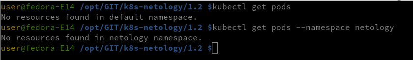
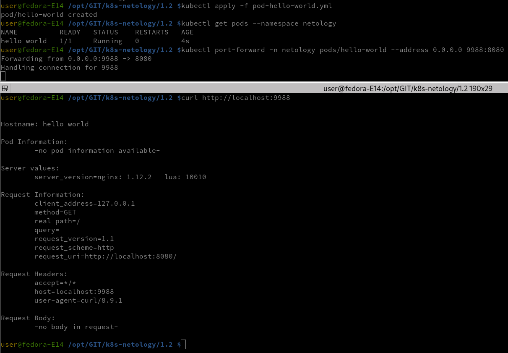
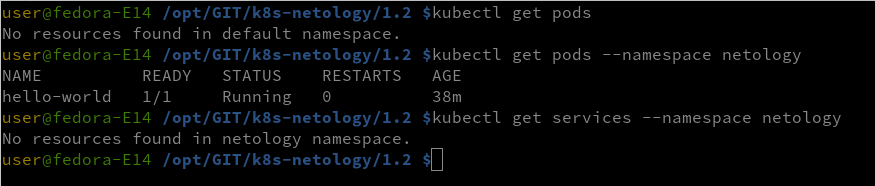
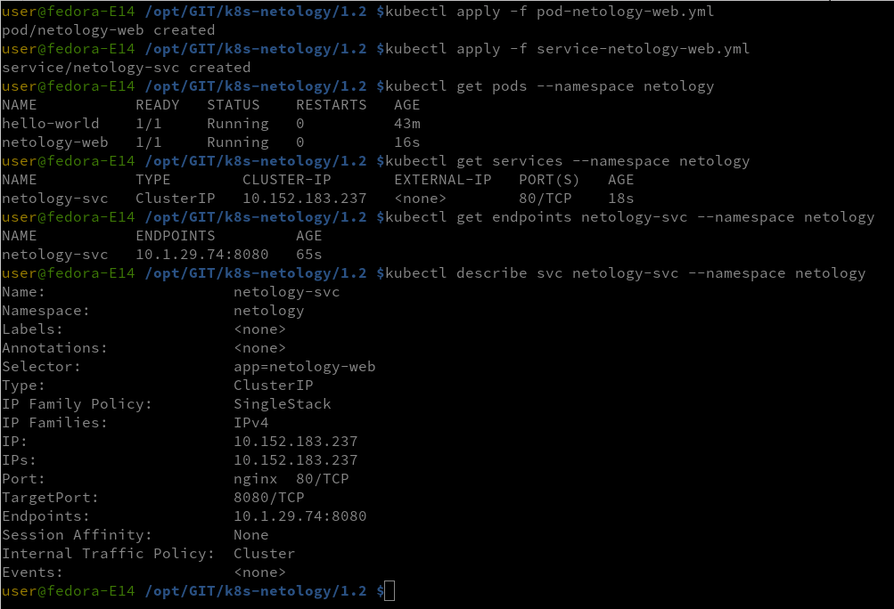
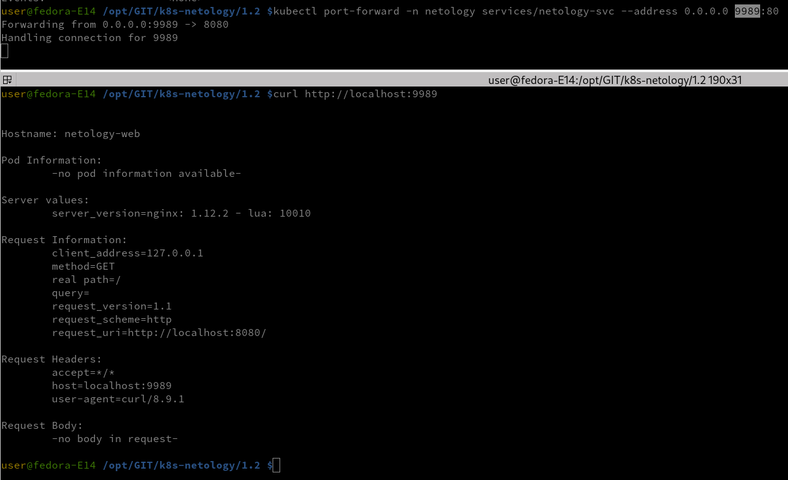

### Задание 1. Создать Pod с именем hello-world
- проверяем - pods отсутствуют - продолжаем

- запускаем pod-hello-world
- проверяем что pod работает
- пробрасываем порты
- и выводим содержимое через curl
  

### Задание 2. Создать Service и подключить его к Pod
- Создать Pod с именем netology-web.
- Создать Service с именем netology-svc и подключить к netology-web.
- Подключиться локально к Service с помощью kubectl port-forward и вывести значение (curl или в браузере).

проверяем

в наличии один pod

запускаем второй pod и создаем сервис, собираем информацию

запускаем проброс портов и выводим в curl

