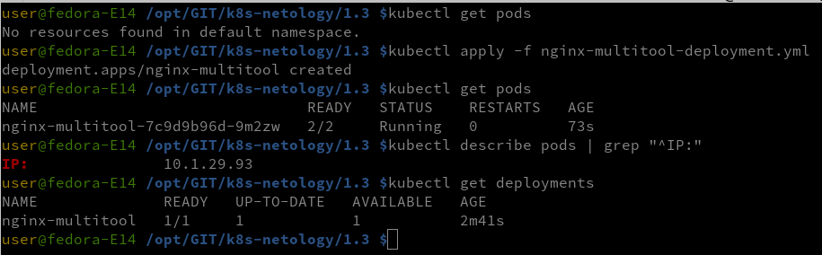
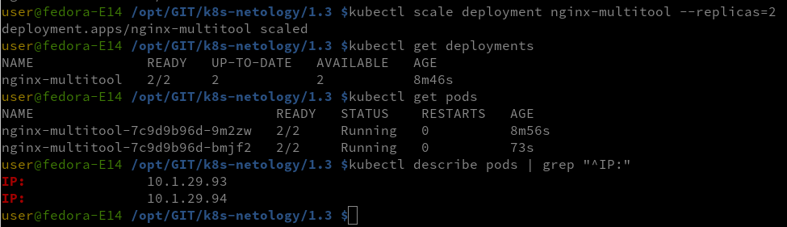
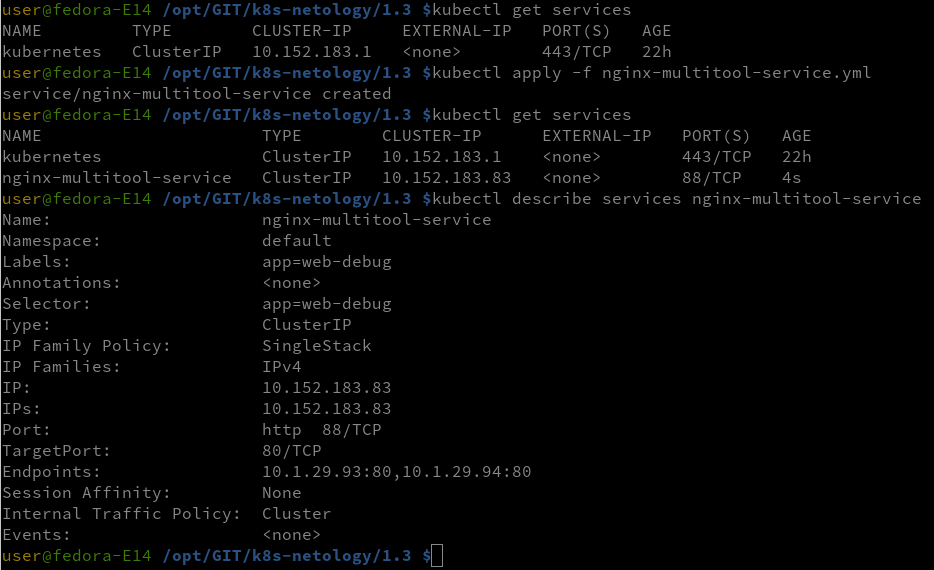
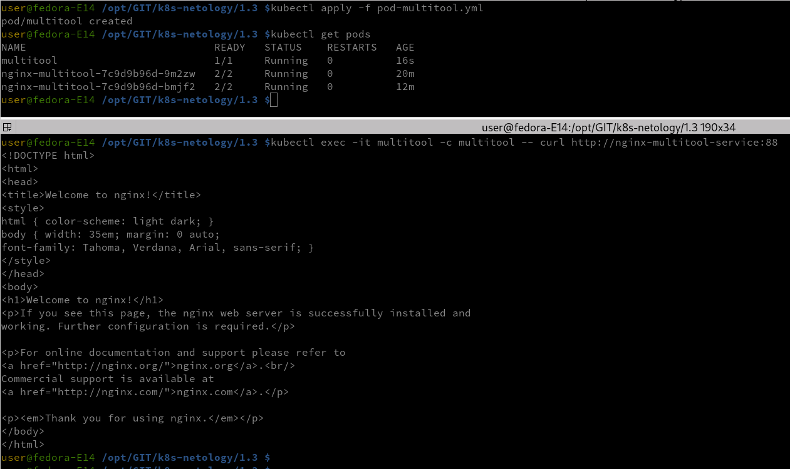
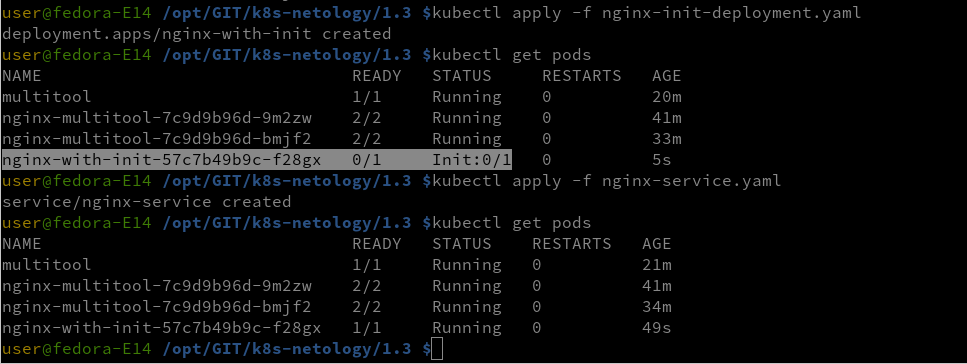

### Задание 1. Создать Deployment и обеспечить доступ к репликам приложения из другого Pod

1.Создать Deployment приложения, состоящего из двух контейнеров — nginx и multitool. Решить возникшую ошибку.

ошибка решается добавлением команды sleep infinity при старте контейнера multitool

- проверяем запущеные pods
- запускаем установку Deployment приложения
- проверка статусов pods
- проверка ip адреса
- проверка Deployment

- добавляем реплику Deployment приложения
- проверяем - реплика поднялась, дополнительный pod работает

4.Создать Service, который обеспечит доступ до реплик приложений из п.1.

5.Создать отдельный Pod с приложением multitool и убедиться с помощью curl, что из пода есть доступ до приложений из п.1

Манифесты 
- [Nginx-multitool-deployment.yml](nginx-multitool-deployment.yml) 
- [Nginx-multitool-service.yml](nginx-multitool-service.yml)
- [Pod-multitool.yml](pod-multitool.yml)

### Задание 2. Создать Deployment и обеспечить старт основного контейнера при выполнении условий

- запускаем deployment nginx с init контейнером
- проверяем статус pods
- запускам nginx-service
  

Манифесты 
- [Nginx-init-deployment.yaml](nginx-init-deployment.yaml)
- [Nginx-service.yaml](nginx-service.yaml)
