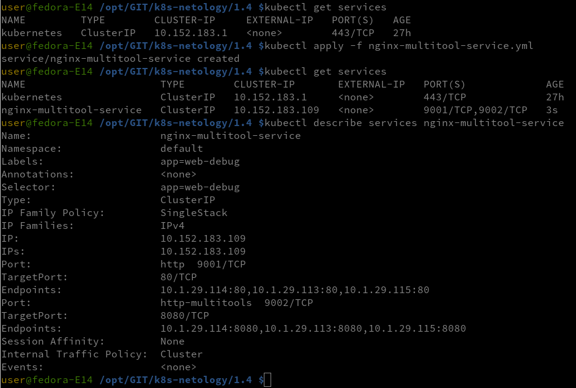

### Задание 1. Создать Deployment и обеспечить доступ к контейнерам приложения по разным портам из другого Pod внутри кластера

- Создать Deployment приложения, состоящего из двух контейнеров (nginx и multitool), с количеством реплик 3 шт.

- Создать Service, который обеспечит доступ внутри кластера до контейнеров приложения из п.1 по порту 9001 — nginx 80, по 9002 — multitool 8080.

- Создать отдельный Pod с приложением multitool и убедиться с помощью curl, что из пода есть доступ до приложения из п.1 по разным портам в разные контейнеры.
- Продемонстрировать доступ с помощью curl по доменному имени сервиса.

Манифест
- [Nginx-multitool-deployment](nginx-multitool-deployment.yml)
- [Nginx-multitool-service](nginx-multitool-service.yml)
- [Pod-multitool](pod-multitool.yml)

### Задание 2. Создать Service и обеспечить доступ к приложениям снаружи кластера

- Создать отдельный Service приложения из Задания 1 с возможностью доступа снаружи кластера к nginx, используя тип NodePort.

Манифест
- [External_port](external_port.yml)