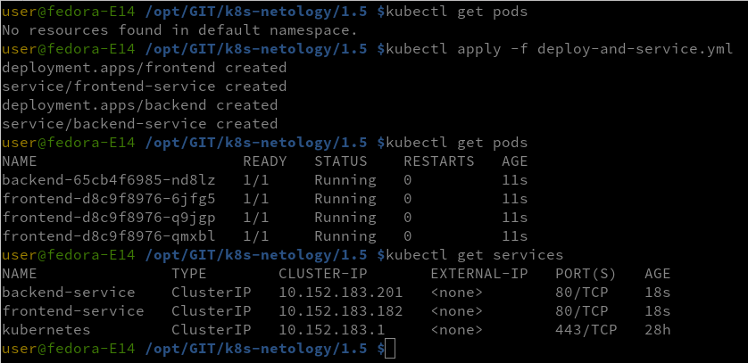
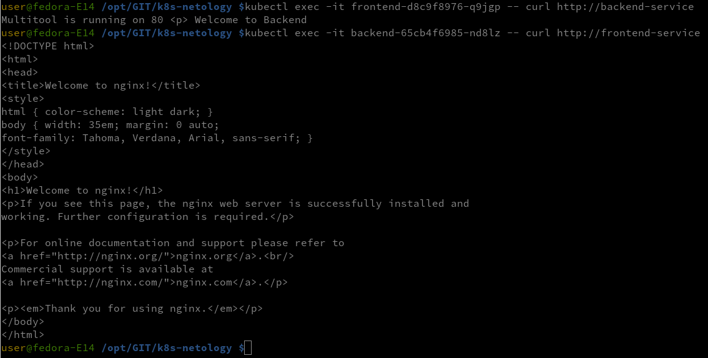
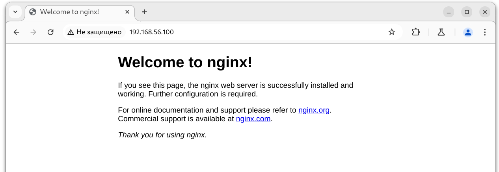
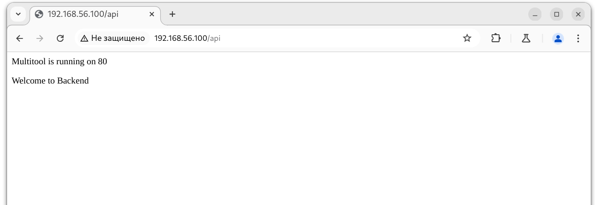

### Задание 1. Создать Deployment приложений backend и frontend
- Создать Deployment приложения frontend из образа nginx с количеством реплик 3 шт.
- Создать Deployment приложения backend из образа multitool.
- Добавить Service, которые обеспечат доступ к обоим приложениям внутри кластера.

- Продемонстрировать, что приложения видят друг друга с помощью Service.

Манифест
- [Deploy-and-Service](deploy-and-service.yml)

### Задание 2. Создать Ingress и обеспечить доступ к приложениям снаружи кластера

Запрос с браузера
- front
  

- back
  

Манифест
- [Ingress.yml](ingress.yml)