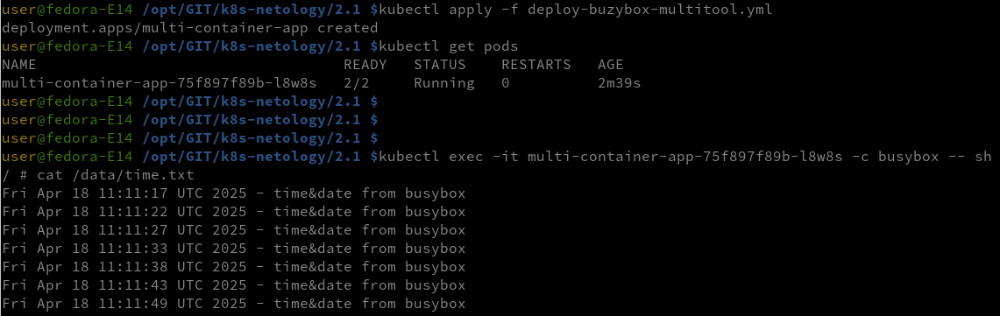
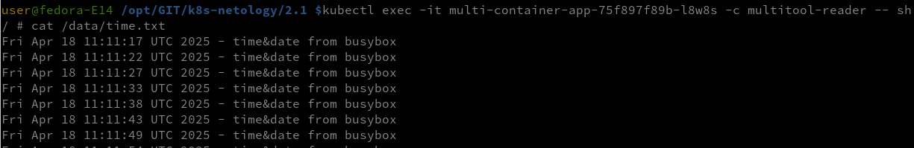
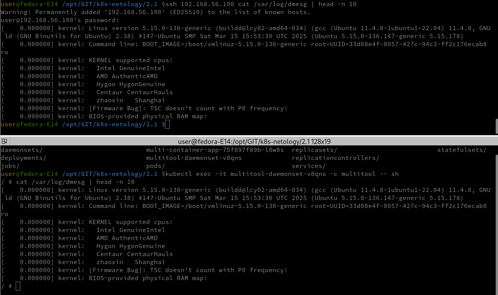

### В тестовой среде Kubernetes нужно обеспечить обмен файлами между контейнерам пода и доступ к логам ноды.

#### Создать Deployment приложения, состоящего из двух контейнеров и обменивающихся данными.

- Создать Deployment приложения, состоящего из контейнеров busybox и multitool.
- Сделать так, чтобы busybox писал каждые пять секунд в некий файл в общей директории.
  
  
  
- Обеспечить возможность чтения файла контейнером multitool.
- Продемонстрировать, что multitool может читать файл, который периодоически обновляется.
  
  

  Манифест
  - [Deploy-Buzybox-Multitool](deploy-buzybox-multitool.yml)

#### Создать DaemonSet приложения, которое может прочитать логи ноды.

- Создать DaemonSet приложения, состоящего из multitool.
- Обеспечить возможность чтения файла /var/log/syslog кластера MicroK8S.
- Продемонстрировать возможность чтения файла изнутри пода.

  

  Манифест
  - [DaemonSet-multitool](daemonSet-multitool.yml)