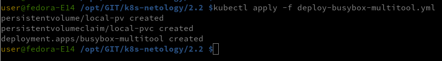
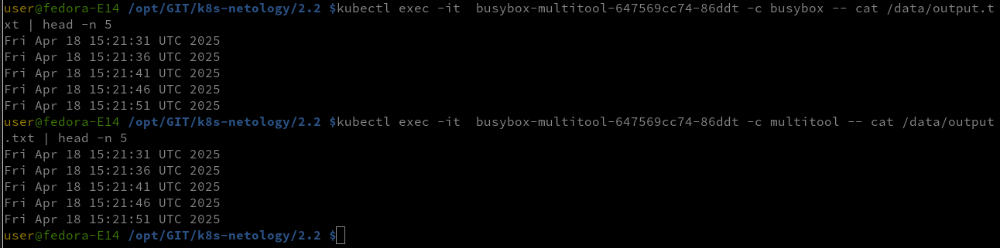
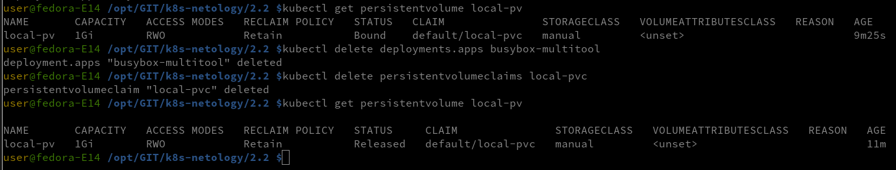
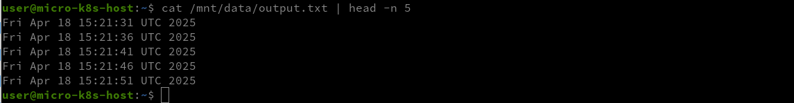
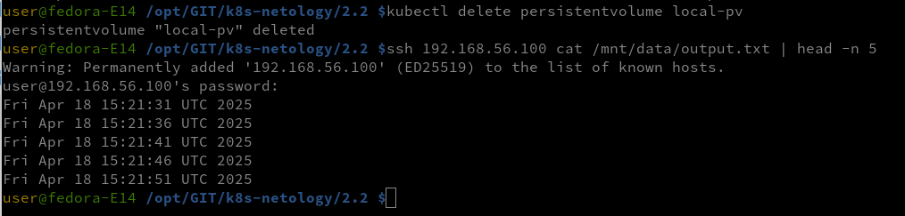
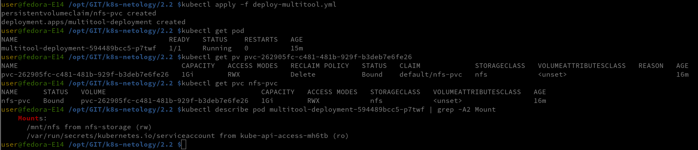
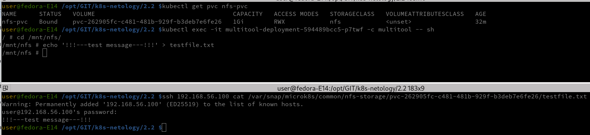

### Домашнее задание к занятию «Хранение в K8s. Часть 2»

#### Создать Deployment приложения, использующего локальный PV, созданный вручную.

- Создать Deployment приложения, состоящего из контейнеров busybox и multitool.
- Создать PV и PVC для подключения папки на локальной ноде, которая будет использована в поде.

- Продемонстрировать, что multitool может читать файл, в который busybox пишет каждые пять секунд в общей директории.

- Удалить Deployment и PVC. Продемонстрировать, что после этого произошло с PV. Пояснить, почему.

После удаления Deployment и PVC, PV будет в состоянии Released. У PV есть reclaimPolicy, который определяет, что делать с хранилищем после удаления PVC.

Если reclaimPolicy: Retain, Kubernetes не удаляет данные, а оставляет PV в состоянии Released.

- Продемонстрировать, что файл сохранился на локальном диске ноды. Удалить PV. Продемонстрировать что произошло с файлом после удаления PV. Пояснить, почему.

После удаления PV файл на локальном диске останется, потому что PV не управляет удалением данных на локальной папке (hostPath).

Манифест

[Deploy-Busybox-Multitool](deploy-busybox-multitool.yml)

#### Создать Deployment приложения, которое может хранить файлы на NFS с динамическим созданием PV.

- Включить и настроить NFS-сервер на MicroK8S. Дополнительно на хосте Microk8s должны быть утилиты nfs (sudo apt install nfs-common -y)
- Создать Deployment приложения состоящего из multitool, и подключить к нему PV, созданный автоматически на сервере NFS.

- Продемонстрировать возможность чтения и записи файла изнутри пода.

Манифест
[Deploy-Multitool](deploy-multitool.yml)

