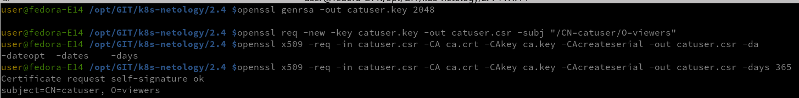
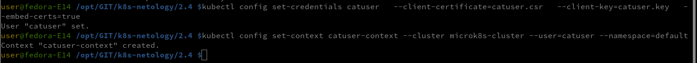
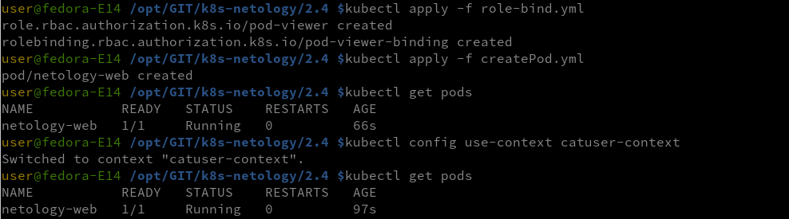
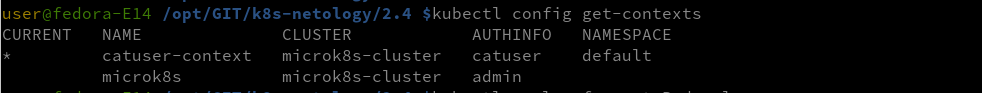
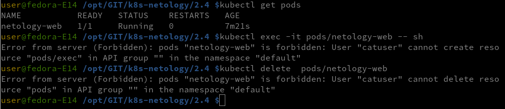

## Домашнее задание к занятию «Управление доступом»

### Задание 1. Создайте конфигурацию для подключения пользователя

- Создайте и подпишите SSL-сертификат для подключения к кластеру.
- Настройте конфигурационный файл kubectl для подключения.
- Создайте роли и все необходимые настройки для пользователя.
- Предусмотрите права пользователя. Пользователь может просматривать логи подов и их конфигурацию (kubectl logs pod <pod_id>, kubectl describe pod <pod_id>).

### Решение:
- включаем RBAC `microk8s enable rbac`
- создаем сертификаты для пользователя

- создаем пользователя в microk8s

- применяем роль, запускаем под, меняем пользовательский контекст
  

- проверяем контекст

- проверяем ограничения

Манифест
[role-bind.yml](role-bind.yml)
[createPod.yml](createPod.yml) 