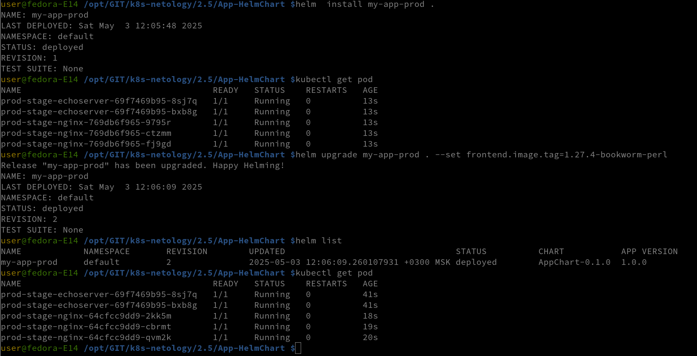
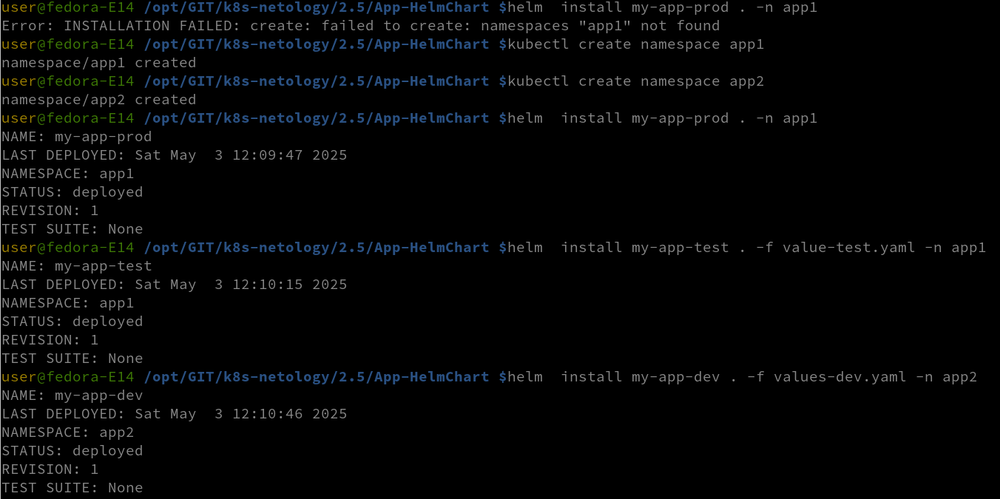
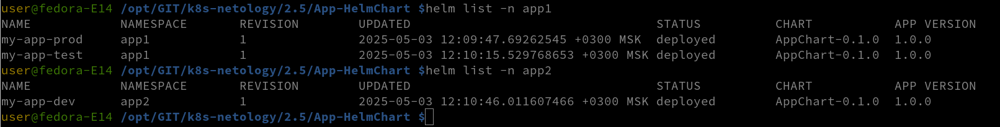
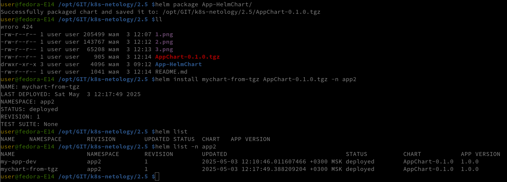

## Домашнее задание к занятию «Helm»
#### Задание 1. Подготовить Helm-чарт для приложения
- Необходимо упаковать приложение в чарт для деплоя в разные окружения.
- Каждый компонент приложения деплоится отдельным deployment’ом или statefulset’ом.
- В переменных чарта измените образ приложения для изменения версии.

#### Задание 2. Запустить две версии в разных неймспейсах
- Подготовив чарт, необходимо его проверить. Запуститe несколько копий приложения.
- Одну версию в namespace=app1, вторую версию в том же неймспейсе, третью версию в namespace=app2.

Упаковка chart в архив и использование

[AppChart-0.1.0.tgz](AppChart-0.1.0.tgz)